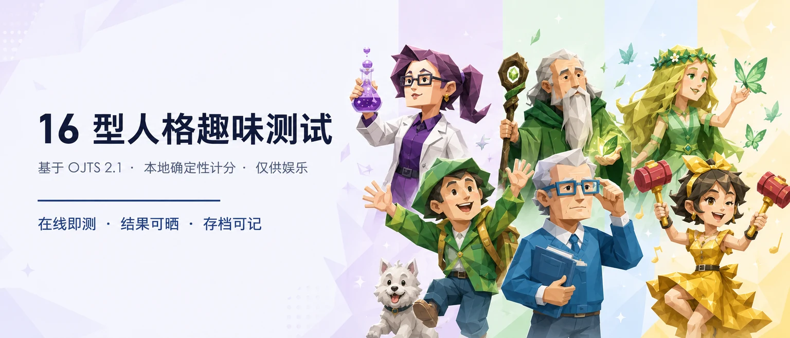
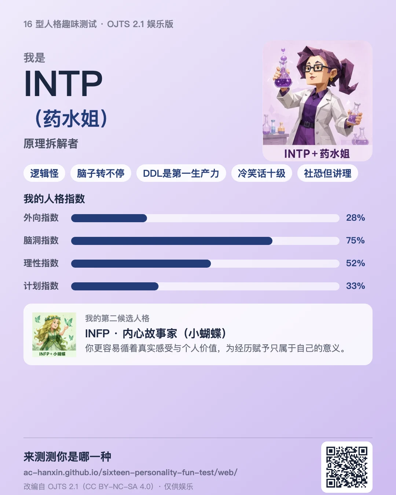
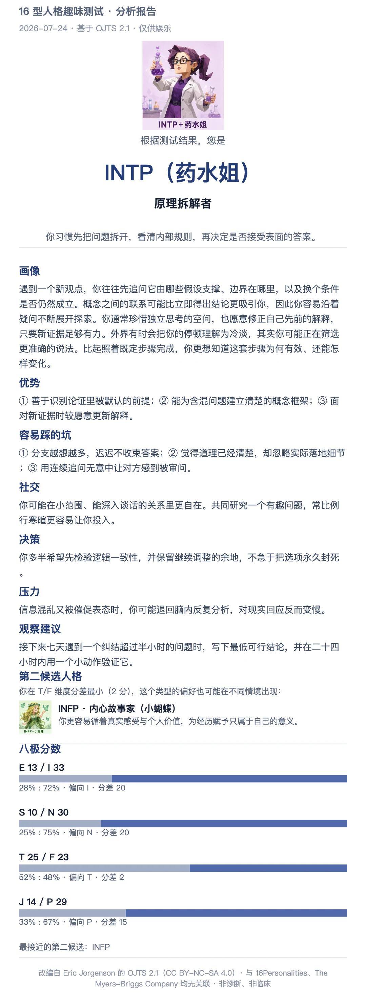
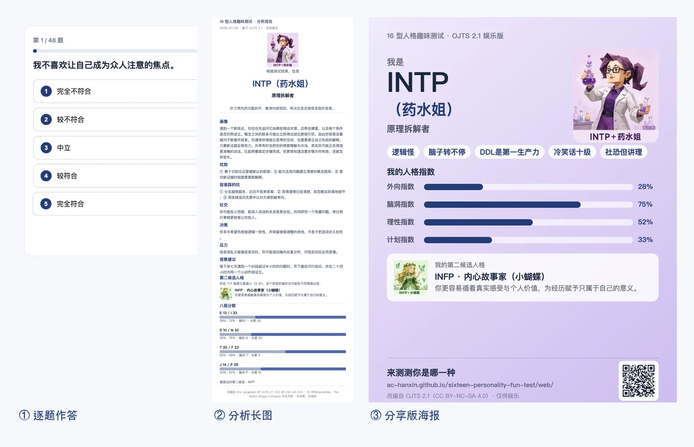
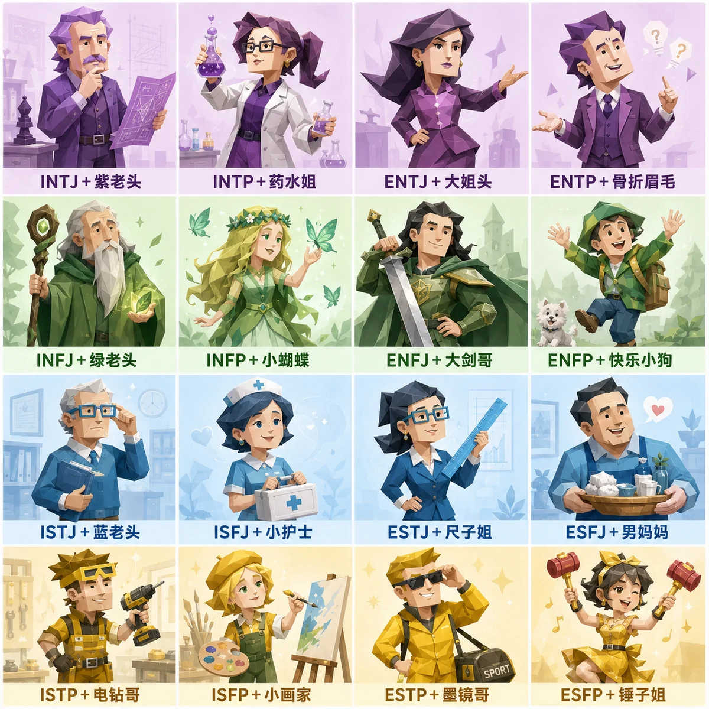
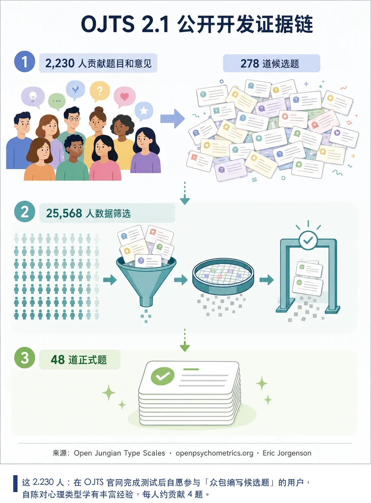
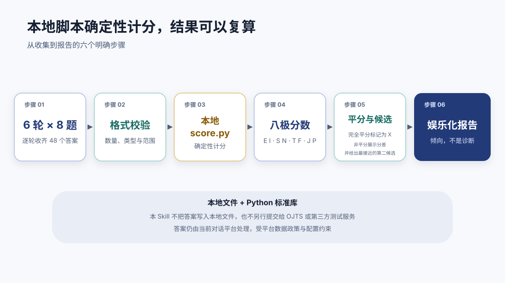

<p align="center">
  
</p>

<p align="center">
  <strong>把你的答案变成一份看得懂边界的人格报告：48 题 · 本地确定性计分 · 角色形象 · 长图可晒 · 存档可记</strong><br/>
  <sub>A reproducible, agent-native Chinese workflow for the Open Jungian Type Scales 2.1 — for entertainment only.</sub>
</p>

<p align="center">
  <a href="https://img.shields.io/badge/web-zero_install-2f4b7c?style=flat-square"></a>
  <a href="https://img.shields.io/badge/license-CC_BY--NC--SA_4.0-2f4b7c?style=flat-square"></a>
</p>

<p align="center">
  <strong>中文</strong> · <a href="README_EN.md">English</a> ·
  <a href="#三种用法">用法</a> ·
  <a href="#你会得到什么">结果</a> ·
  <a href="#十六型速览">十六型</a> ·
  <a href="#可信度与开发证据">可信度</a> ·
  <a href="#开发者">开发者</a>
</p>

---

## 三种用法

| | 适合 | 怎么做 |
| --- | --- | --- |
| **A · 网页版** | 任何人，手机即可 | 打开 **https://Ac-Hanxin.github.io/sixteen-personality-fun-test/web/** 直接开测，无需安装；`#demo` 看示例结果 |
| **B · 一键部署** | 有 AI Agent 的人 | 复制下方提示词发给你的 Agent，自动完成部署、测试与记忆沉淀 |
| **C · 手动安装** | 开发者 | 见[开发者](#开发者)折叠区 |

**B 的提示词（复制即用）**

Hermes 版（利用其长期记忆沉淀结果）：

```text
请克隆 GitHub 项目 https://github.com/Ac-Hanxin/sixteen-personality-fun-test ，将整个目录复制到 ~/.hermes/skills/sixteen-personality-fun-test（保留 SKILL.md、references/、scripts/、assets/ 的相对位置），确认 sixteen-personality-fun-test 技能可用后，带我做一次完整的 16 型人格趣味测试；测试结束后，把结果卡存入你的长期记忆。
```

通用版（Claude Code / Codex / 其他支持 Skills 的客户端）：

```text
请克隆 GitHub 项目 https://github.com/Ac-Hanxin/sixteen-personality-fun-test ，将整个目录复制到我的技能目录（Claude Code 为 ~/.claude/skills/，Codex 为 ~/.codex/skills/，其他客户端以实际配置为准），目录名保持 sixteen-personality-fun-test 并保留内部相对结构，确认技能可用后，带我做一次完整的 16 型人格趣味测试；测试结束后，把结果卡存入你的长期记忆。
```

## 你会得到什么

一份可以晒出去、也能交给 AI 助理记住的分析报告：

- **结论句**：「根据测试结果，您是 INTP（药水姐）」——确定、不可手动调换，同一组答案永远得到同一结果
- **主人格 + 第二候选人格**：角色形象、画像、3 项优势、3 项坑、社交、决策、压力、观察建议；分差最小时展示一个第二候选人格
- **八极分数**：E/I、S/N、T/F、J/P 四组原始分、占比与分差；完全平分标记为 X
- **三个带走方式**：**分享版海报**（组色竖版，含角色、梗标签、人格指数、第二候选人格与二维码，专为朋友圈/社媒设计）、**分析长图**（包含全部报告内容，自己留存）、**存档提示词**（≤2000 字符，发给助理存入长期记忆，以后做决策时作为参考依据之一）

<table>
  <tr>
    <td width="46%"></td>
    <td width="54%"></td>
  </tr>
  <tr>
    <td align="center"><sub>分享版（作者本人实测结果）</sub></td>
    <td align="center"><sub>分析长图（作者本人实测结果）</sub></td>
  </tr>
</table>

## 从答题到出图，就这三步

<p align="center">
  
</p>

前 40 题为陈述题（1 = 不同意，3 = 中立，5 = 同意），后 8 题为双极词组题（1 = 偏左，3 = 居中，5 = 偏右）。网页版进度自动保存在本机浏览器，刷新可断点续答。

## 十六型速览

<p align="center">
  
</p>

角色形象为本项目以 AI 工具生成的原创渲染（提示词与差异化规则见 [`docs/character-prompts.md`](docs/character-prompts.md)）。每种类型的正式昵称与概括：

| 组 | 类型 | 原创昵称 | 社区俗称 | 一句话概括 |
| --- | --- | --- | --- | --- |
| NT · 紫人组 | INTJ | 系统蓝图师 | 紫老头 | 先在脑中搭好长期结构，再全力投入。 |
| NT · 紫人组 | INTP | 原理拆解者 | 药水姐 | 拆开问题看清规则，再决定接不接受。 |
| NT · 紫人组 | ENTJ | 目标统筹者 | 大姐头 | 把模糊愿望变成目标、资源和节点。 |
| NT · 紫人组 | ENTP | 可能性试验家 | 骨折眉毛 | 在观点碰撞中发现新可能，用实验验证。 |
| NF · 绿人组 | INFJ | 深层洞察者 | 绿老头 | 读懂言行背后的意义，守住长期原则。 |
| NF · 绿人组 | INFP | 内心故事家 | 小蝴蝶 | 循着真实感受，为经历赋予自己的意义。 |
| NF · 绿人组 | ENFJ | 共鸣引导者 | 大剑哥 | 感知关系中的需要，用愿景带动大家。 |
| NF · 绿人组 | ENFP | 灵感点火者 | 快乐小狗 | 被新鲜想法点亮，也用热情点亮别人。 |
| SJ · 蓝人组 | ISTJ | 稳序守护者 | 蓝老头 | 信任可核对的事实，认真对待每个承诺。 |
| SJ · 蓝人组 | ISFJ | 细节照料者 | 小护士 | 记住具体需要，用细小行动照顾别人。 |
| SJ · 蓝人组 | ESTJ | 秩序推进者 | 尺子姐 | 把规则和分工讲清楚，推动事情落地。 |
| SJ · 蓝人组 | ESFJ | 氛围联结者 | 男妈妈 | 留意每个人是否被接纳，维系群体温度。 |
| SP · 黄人组 | ISTP | 冷静解题者 | 电钻哥 | 先观察现场怎么运作，再简洁地修好它。 |
| SP · 黄人组 | ISFP | 感受收藏家 | 小画家 | 细致接收当下体验，温和表达珍视之物。 |
| SP · 黄人组 | ESTP | 现场破局者 | 墨镜哥 | 快速读取现实机会，直接试错破局。 |
| SP · 黄人组 | ESFP | 快乐放大者 | 锤子姐 | 全身心投入当下，把快乐放大给更多人。 |

「社区俗称」是中文社区围绕 16Personalities 角色形象形成的迷因称呼（与上方群像字幕一致），不是任何品牌的官方名称，也不是本项目的正式命名；本项目正式昵称见「原创昵称」列，完整画像见 `references/type-profiles.md`。

## 可信度与开发证据

这里的「可信」不是权威背书，而是把来源、方法、计算和限制同时摊开，允许读者自行核查。

- **来源可查**：题库 `references/questions.json` 保留 OJTS 2.1 英文原题、题号、计分键、版本与作者署名，可直接对照第一手来源页面。
- **计分可复算**：`scripts/score.py` 只用本地确定性规则（Python 标准库，无外部调用）；相同 48 个答案得到相同分数与类型；网页版 `web/scoring.js` 为其逐分等价的 JS 实现。
- **边界确定**：**完全平分标记为 X**，按固定顺序展示首个候选；**非平分展示分差并给出最接近的第二候选**；如果多个维度的最小分差并列，第二候选可能不止一个。
- **筛选全程公开**：OJTS 开发页附录 A 公开了全部受筛题目清单（Full list of items screened）；筛选方法是经验实证——只保留能区分自报类型的题目，而非理论臆造。
- **独立比较领先**：开发方在 OEJTS 比较页面中对多款在线测验做了对比，OJTS 的自报类型与测验结果一致度最高（来源见下方链接）。
- **测试兜底**：32 项单元测试，包含与公开站点逐分对照的固定样本、JS 与 Python 计分对照（需 node，缺失时自动跳过）、题库完整性、文案边界与资产一致性。

**开发证据**：OJTS 开发方公开页面描述了从候选内容到正式量表的筛选过程：先是 **2,230** 名在官网测试后自愿参与众包编写的用户（自陈对心理类型学有丰富经验，每人约写 4 题）贡献了候选内容，形成 **278** 道的候选池；随后用 **25,568** 名自报已知自己类型且熟悉心理类型学的参与者数据，按题目区分度逐步筛选，最终形成 **48** 道正式题。开发方还公开了众包原始产物（crowdsourced-items.txt），并坦承其中大多「显而易见或不合格」——筛选的严格程度因此可全程核查。

<p align="center">
  
</p>

这些 **2,230、278、25,568、48** 均来自 OJTS 开发方公开页面，是开发过程的可核查说明，**不是独立临床认证**，也不能证明它适合医疗诊断、招聘筛选或其他高风险决策。

**与官方网站的已知差异（E/I 轴）**：本项目按题目语义计分——同意「聚会时我往往能够带动气氛」会增加 E 分。截至 2026 年 7 月，openpsychometrics.org 的 OJTS 2.1 在线版本在 E/I 轴上的服务端计分与其页面自身的题注相反（其前端代码将 Q1–Q3 注释为 I、Q4–Q6 注释为 E，服务端却把 Q4–Q6 的分值计入 I，双极题 S4、S8 同样相反）。S/N、T/F、J/P 三轴本项目与官方网站完全一致；E/I 轴上，同一组答案在两边得到的字母可能不同。复现方法：在官方网站作答时，将 *I want a huge social circle.*、*I am the life of the party.*、*I make lots of noise.* 三题选 Strongly agree、其余全部中立——语义上应偏向 E，官方网站却会显示 I 开头的类型。本项目的单元测试用两组固定样本（V4、V5）逐分记录了上述差异。

## 隐私与边界

运行时只读取本地题库并调用本地 Python 标准库脚本；本 Skill 不把答案写入本地文件，也不另行提交给 OJTS 或第三方测试服务，并且不请求姓名、账号或其他身份信息。答案仍在当前对话中由平台处理，对话内容如何存储与使用受平台数据政策与配置约束，不属于本 Skill 的控制范围。网页版的所有计分在浏览器本地完成，答案不离开你的设备；断点续答的进度只保存在本机浏览器，点「重新测试」即清除。

| 能说什么 | 不能说什么 |
| --- | --- |
| 「这次答案更偏向 I 与 N。」 | 「你天生注定就是这个类型。」 |
| 「这个结果可以作为自我观察的起点。」 | 「它能诊断心理状况或人格障碍。」 |
| 「分差较小，另一侧偏好也可能在不同情境出现。」 | 「该类型证明你适合或不适合某份工作。」 |
| 「这是基于 OJTS 2.1 的中文娱乐型工作流。」 | 「这是官方 MBTI 测试、临床工具或 16Personalities 产品。」 |

本项目**不是官方 MBTI**，仅供娱乐与自我探索。不得把结果用于临床、医学、教育分流、招聘、绩效或其他对个人有重大影响的判断。

## 开发者

<details>
<summary><strong>手动安装</strong></summary>

前置要求：Python 3.9 或更高版本（计分仅用标准库；导出结果长图需要 `pip3 install Pillow`），以及一个支持 Skills 的 Agent 客户端。

```bash
git clone https://github.com/Ac-Hanxin/sixteen-personality-fun-test.git
cd sixteen-personality-fun-test

# Claude Code（用户级技能目录）
cp -R . ~/.claude/skills/sixteen-personality-fun-test

# Codex（用户级技能目录）
cp -R . ~/.codex/skills/sixteen-personality-fun-test

# Hermes Agent（用户级技能目录）
cp -R . ~/.hermes/skills/sixteen-personality-fun-test
```

不同客户端与版本的技能目录可能不同，请以你当前客户端的配置与技能发现结果为准；本项目不承诺某个未经本机验证的第三方安装命令。安装后新开会话输入「帮我做一次完整的 16 型人格趣味测试」即可验证。

**演示 / 复测快捷用法**：把 48 个答案按 Q1–Q40、S1–S8 的顺序（1–5 的整数，空格或逗号分隔）一次性发给 Agent，校验通过后会直接计分并生成报告。

</details>

<details>
<summary><strong>不用 Agent，直接计分（CLI）</strong></summary>

```bash
python3 scripts/score.py --answers "3 3 3 …（共 48 个，空格或逗号分隔）"
```

输出 JSON 包含八极 `scores`、四轴占比与分差 `axes`、原始类型 `raw_type`（平分轴记为 `X`）、`candidates` 与 `second_candidates`。渲染结果长图：

```bash
pip3 install Pillow
python3 scripts/render_card.py --answers "<48 个答案>" --out result.png
```

</details>

<details>
<summary><strong>项目结构</strong></summary>

```
sixteen-personality-fun-test/
├── SKILL.md                  # Agent 工作流：提问、校验、计分、报告与边界规则
├── agents/openai.yaml        # Codex 客户端的展示元数据
├── references/
│   ├── questions.json        # OJTS 2.1 题库：中英对照原题 + 计分键 + 来源信息
│   └── type-profiles.md      # 16 型原创中文画像素材（含社区俗称）
├── scripts/
│   ├── score.py              # 确定性计分 CLI（仅标准库）
│   ├── render_card.py        # 渲染分析结果长图 PNG（需要 Pillow）
│   ├── build_web_data.py     # 由 references/ 生成 web/data.js 与 web/avatars64.js
│   └── slice_avatars.py      # 由 4×4 群像切割 16 张单人头像
├── web/
│   ├── index.html            # 零安装网页版（手机可用，纯前端本地计分，可生成长图）
│   ├── scoring.js            # score.py 的 JS 等价实现（测试与 Python 版逐分对照）
│   ├── data.js               # 题库与画像数据（脚本生成，请勿手改）
│   └── avatars64.js          # 头像 base64 数据（供 Canvas 出图，脚本生成）
├── assets/                   # 角色群像、16 张单人头像、横幅、样例图与 SVG 文档图形
├── docs/character-prompts.md # 16 型角色插画的 AI 生成提示词与差异化规则
├── tests/                    # 32 项单元测试
└── LICENSE                   # CC BY-NC-SA 4.0
```

测评流程示意：

<p align="center">
  
</p>

</details>

<details>
<summary><strong>运行测试</strong></summary>

```bash
python3 -m unittest discover -s tests -v
```

32 项测试覆盖：计分正确性（含与公开站点对照的固定样本）、网页版 JS 与 Python 计分逐分对照（需要 node，未安装时自动跳过）、题库完整性、16 型文案结构与措辞边界、SKILL.md 契约，以及本 README 与其图像资产的一致性。

</details>

## 来源、署名与许可

- [Open Jungian Type Scales 主页](https://openpsychometrics.org/tests/OJTS/)
- [OJTS 开发方法与题目筛选](https://openpsychometrics.org/tests/OJTS/development/)
- [Open Extended Jungian Type Scales 比较页面](https://openpsychometrics.org/tests/OEJTS/comparison/)
- [Creative Commons Attribution-NonCommercial-ShareAlike 4.0 International](https://creativecommons.org/licenses/by-nc-sa/4.0/)

本包改编自 Eric Jorgenson 的 Open Jungian Type Scales / Open Extended Jungian Type Scales，并按 **CC BY-NC-SA 4.0** 提供。改编内容包括简体中文翻译、Agent 交互工作流、确定性计分实现、原创类型文案与原创 SVG 文档图形；README 中的 16 型角色插画为本项目以 AI 工具生成的原创渲染。中文翻译力求自然且保留原题含义；如有歧义，应以保留的英文原文与来源页面为核查基准。

本项目与 Eric Jorgenson、The Myers-Briggs Company 或 16Personalities 均无关联，也未获其认可。本项目不包含 16Personalities 的题目、官方类型名称、插画原作或报告文案；「社区俗称」为中文社区迷因，并非 16Personalities 官方内容。

完整许可与署名声明见 [`LICENSE`](LICENSE)。

## 作者与交流

- 抖音：[@你的抖音号](https://www.douyin.com/user/你的主页ID)——演示视频、使用反馈与版本更新
- 欢迎 Issues 与 PR：题库勘误、翻译建议、客户端适配反馈
