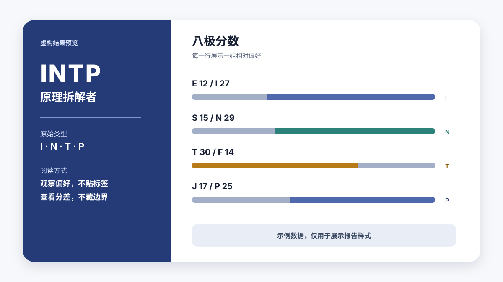
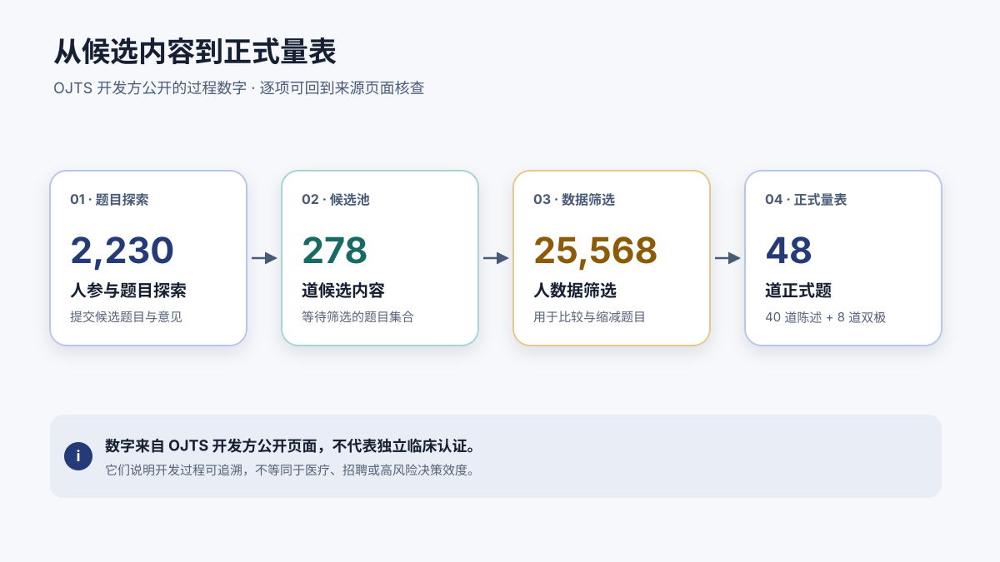

<h1 align="center">16 Personalities Fun Test</h1>

<p align="center">
  <strong>A reproducible, agent-native Chinese workflow for the Open Jungian Type Scales 2.1</strong><br/>
  <sub>48 questions · deterministic local scoring · strictly for entertainment</sub>
</p>

<p align="center">
  
  
  
  
  
  
</p>

<p align="center">
  <a href="README.md">中文</a> · <strong>English</strong>
</p>

<p align="center">
  <a href="#zero-install-web-version">Web version</a> ·
  <a href="#one-prompt-deployment-copy--paste-to-your-agent">Deploy prompt</a> ·
  <a href="#quick-start">Quick start</a> ·
  <a href="#the-sixteen-types-at-a-glance">Type table</a> ·
  <a href="#scoring-rules-and-boundaries">Scoring</a> ·
  <a href="#where-credibility-comes-from">Credibility</a> ·
  <a href="#privacy">Privacy</a> ·
  <a href="#sources-attribution--license">License</a>
</p>

<p align="center">
  
</p>

---

> **Note:** the assessment itself — questions, reports, and type profiles — is in **Simplified Chinese**. This README is for developers who want to understand, install, or adapt the project.

Turn your AI agent into a restrained, transparent test host: 48 questions in 6 guided rounds, deterministic local scoring, and a Chinese report that is honest about its own boundaries. No guessing, no exaggeration, no impersonating official instruments — every number can be traced back to a first-hand source.

| Capability | Details |
| --- | --- |
| Zero-install web version | Open in a browser and start; mobile-friendly; fully client-side scoring; one-tap result card for your AI assistant |
| One-prompt deployment | Paste a single prompt to your agent: clone, install, run the assessment, and save the result to long-term memory |
| Guided answering | 48 questions in 6 rounds of 8; answers separated by spaces, commas (English or Chinese), or semicolons; only wrong slots are re-asked |
| Deterministic local scoring | `scripts/score.py` uses only the Python standard library; identical answers always yield identical results |
| Deterministic boundary handling | Exact ties are marked X; the first candidate (fixed order) is shown; non-tied axes show the difference and the closest second candidate |
| Original Chinese profiles | Tendency-based copy for all 16 types: 3 strengths, 3 pitfalls, social style, decisions, stress, and observation tips |
| Privacy-respecting | Answers are never written to local files, never submitted to OJTS or third-party test services, and no identity is requested |
| Fully auditable | The bank keeps original English items, IDs, and scoring keys; 31 unit tests include fixtures compared score-by-score with the public site |

## Zero-install web version

Nothing to install? The repo ships a fully client-side web version that works on phones:

**https://Ac-Hanxin.github.io/sixteen-personality-fun-test/web/**

- 48 questions, one per screen, with undo; progress auto-saves to your browser's localStorage so a refresh or app switch never loses it; all scoring runs locally — answers never leave your device.
- The result page includes the type character, eight-pole bars, the full profile, and a compact result card you can copy to your AI assistant.
- Preview the result page via `#demo`, or jump straight into the quiz via `#quiz`.

To publish it (repo owner): GitHub → Settings → Pages → Deploy from a branch → `main` / `(root)`. The link goes live a few minutes later.

## One-prompt deployment (copy & paste to your agent)

**Hermes edition** (demo setup; its long-term memory keeps the result):

```text
请克隆 GitHub 项目 https://github.com/Ac-Hanxin/sixteen-personality-fun-test ，将整个目录复制到 ~/.hermes/skills/sixteen-personality-fun-test（保留 SKILL.md、references/、scripts/、assets/ 的相对位置），确认 sixteen-personality-fun-test 技能可用后，带我做一次完整的 16 型人格趣味测试；测试结束后，把结果卡存入你的长期记忆。
```

**Generic edition** (Claude Code / Codex / other skill-capable clients):

```text
请克隆 GitHub 项目 https://github.com/Ac-Hanxin/sixteen-personality-fun-test ，将整个目录复制到我的技能目录（Claude Code 为 ~/.claude/skills/，Codex 为 ~/.codex/skills/，其他客户端以实际配置为准），目录名保持 sixteen-personality-fun-test 并保留内部相对结构，确认技能可用后，带我做一次完整的 16 型人格趣味测试；测试结束后，把结果卡存入你的长期记忆。
```

(The prompts are intentionally in Chinese — they drive a Chinese-language assessment.)

## Quick start

**Requirements**

- Python 3.9+ (scoring uses only the standard library, zero dependencies; exporting the result image requires `pip3 install Pillow`)
- An agent client that supports Skills: Codex, Claude Code, or anything that discovers `SKILL.md`

**Install**

```bash
git clone https://github.com/Ac-Hanxin/sixteen-personality-fun-test.git
cd sixteen-personality-fun-test
```

Copy the whole directory into your client's skills directory, preserving the relative layout of `SKILL.md`, `references/`, `scripts/`, and `assets/`:

```bash
# Claude Code (user-level)
cp -R . ~/.claude/skills/sixteen-personality-fun-test

# Codex (user-level)
cp -R . ~/.codex/skills/sixteen-personality-fun-test

# Hermes Agent (user-level)
cp -R . ~/.hermes/skills/sixteen-personality-fun-test
```

Skill directories vary by client and version; trust your own client's configuration and skill discovery over any install command the project has not verified on your machine.

**Verify**

Start a new conversation and type:

> 帮我做一次完整的 16 型人格趣味测试

The agent should discover the `sixteen-personality-fun-test` skill: 6 rounds of 8 questions, validation, local scoring, then the report.

**Demo / quick-retake shortcut**

Skip the rounds entirely: send all 48 answers at once, in Q1–Q40 then S1–S8 order (integers 1–5, separated by spaces or commas). Once validated, the agent scores and reports immediately — ideal for demos and retakes.

### Score without an agent

Already have 48 answers (integers 1–5 in Q1–Q40, S1–S8 order)? Score directly:

```bash
python3 scripts/score.py --answers "3 3 3 … (48 values, space or comma separated)"
```

The JSON output contains the eight-pole `scores`, per-axis ratios and differences in `axes`, the `raw_type` (tied axes marked `X`), plus `candidates` and `second_candidates`.

## Assessment flow

<p align="center">
  
</p>

The first 40 items are statements (1 = disagree, 3 = neutral, 5 = agree); the last 8 are bipolar word pairs (1 = left pole, 3 = middle, 5 = right pole). You may revise the previous round or restart at any time.

## Sample result

<p align="center">
  
</p>

The preview shows a fictional **INTP · 原理拆解者** with sample scores `E 12 / I 27`, `S 15 / N 29`, `T 30 / F 14`, `J 17 / P 25`. These numbers illustrate the report layout only — they represent **no real user** and are not a diagnosis or rating.

A real report opens with a verdict line (e.g. "根据测试结果，您是 INTP（药水姐）"), then presents, in order: the type character, type code and nickname (with its community meme name), the original Chinese profile (portrait, strengths, pitfalls, social style, decisions, stress, observation tips), plus a "次人格 (near type)" block when the margin is small (the second candidate's character and one-liner), then the eight-pole raw scores, four axis ratios and differences, boundary hints and second candidates, and finally the entertainment disclaimer. It ends with two options: **Save the analysis** — a single long PNG containing the entire report (rendered by `scripts/render_card.py` on the agent side, requires `pip3 install Pillow`; generated in-browser in the web version); **Copy the archive prompt** — a sub-2000-character result card to paste to your AI assistant for long-term memory.

## The sixteen types at a glance

The hero image above shows the 16 type characters (original AI-generated renders; prompts and divergence rules in [`docs/character-prompts.md`](docs/character-prompts.md)). The project's own nicknames and one-line summaries:

| Group | Type | Project nickname | Community meme | One-liner (translated) |
| --- | --- | --- | --- | --- |
| NT | INTJ | 系统蓝图师 | 紫老头 | Build the long-term structure in your head first, then commit. |
| NT | INTP | 原理拆解者 | 药水姐 | Take the problem apart, see the rules, then decide whether to accept the answer. |
| NT | ENTJ | 目标统筹者 | 大姐头 | Turn vague wishes into goals, resources, and milestones. |
| NT | ENTP | 可能性试验家 | 骨折眉毛 | Find new openings in debate and test which possibilities survive. |
| NF | INFJ | 深层洞察者 | 绿老头 | Read the meaning behind words and actions; hold long-term principles. |
| NF | INFP | 内心故事家 | 小蝴蝶 | Follow authentic feelings and give experiences personal meaning. |
| NF | ENFJ | 共鸣引导者 | 大剑哥 | Sense what relationships need and rally people toward a shared vision. |
| NF | ENFP | 灵感点火者 | 快乐小狗 | Lit up by new people and ideas — and lighting up others in return. |
| SJ | ISTJ | 稳序守护者 | 蓝老头 | Trust verifiable facts and stable processes; honor every commitment. |
| SJ | ISFJ | 细节照料者 | 小护士 | Remember specific needs and care through small, concrete acts. |
| SJ | ESTJ | 秩序推进者 | 尺子姐 | Make rules, roles, and deadlines explicit; push work to completion. |
| SJ | ESFJ | 氛围联结者 | 男妈妈 | Notice who feels left out; keep the group's warmth alive. |
| SP | ISTP | 冷静解题者 | 电钻哥 | Watch how the scene works, then fix it with the simplest action. |
| SP | ISFP | 感受收藏家 | 小画家 | Take in the moment in fine detail; express what you treasure gently. |
| SP | ESTP | 现场破局者 | 墨镜哥 | Read real opportunities fast and break deadlocks by direct trial. |
| SP | ESFP | 快乐放大者 | 锤子姐 | Dive into the moment and amplify joy for everyone around. |

The "community meme" names are Chinese internet nicknames for the 16Personalities characters (matching the captions in the hero image). They are not any brand's official names and not this project's official naming — the project's own nicknames are in the "Project nickname" column; full profiles live in `references/type-profiles.md`.

## Scoring rules and boundaries

The assessment has **48 questions**: 40 statements plus 8 bipolar items. Scores accumulate separately for the eight poles E, I, S, N, T, F, J, P (theoretical range **0–36** each), then the two sides of E/I, S/N, T/F, J/P are compared to form the four-letter raw type.

- **Exact ties are marked X**; all candidates are listed and the first candidate (fixed order) is shown — identical answers always produce the identical page, with no manual override.
- **Non-tied axes show the difference and the closest second candidate**; ties for the smallest difference can yield multiple second candidates.
- Scoring calls no external models or online APIs; answers are processed in the current conversation by the platform.

## Known difference from the official site: the E/I axis

This project scores semantically — agreeing with "I am the life of the party" raises your E score.

As of July 2026, the live OJTS 2.1 site at openpsychometrics.org scores the E/I axis opposite to its own page annotations: its front-end comments label Q1–Q3 as I and Q4–Q6 as E, yet the server credits Q4–Q6 to I (bipolar items S4 and S8 likewise). S/N, T/F, and J/P match the official site exactly; on E/I, the same answers can produce opposite letters.

Reproduce it yourself: on the official site, answer *Strongly agree* to *I want a huge social circle.*, *I am the life of the party.*, and *I make lots of noise.*, and neutral to everything else — semantically extraverted, yet the site reports a type starting with I. Two fixtures (V4, V5) in our unit tests record this difference score by score.

## Where credibility comes from

"Credible" here does not mean authoritative endorsement — it means sources, method, computation, and limits are all laid out for you to check.

| Checkable dimension | What this project does | How you can verify |
| --- | --- | --- |
| Traceable source | Keeps OJTS 2.1 original English items, IDs, scoring keys, version, and author attribution | Compare `references/questions.json` with the first-hand sources below |
| Traceable method | Lists the developer's published sample and screening numbers without dressing them up as clinical certification | Read the OJTS development page and the OEJTS comparison page |
| Reproducible scoring | `scripts/score.py` uses only local deterministic rules; same 48 answers → same scores and type | Run the local tests, or recompute item by item with the scoring keys |
| Deterministic tie display | Exact ties are marked X; non-tied axes show the difference and the closest second candidate | Inspect the raw eight-pole scores, candidates, and differences |

## Development evidence

<p align="center">
  
</p>

The OJTS developer's public page describes the screening pipeline: **2,230** people took part in item exploration, a pool of **278** candidate items was generated, data from **25,568** participants was used for screening, and **48** final items were selected.

All of **2,230, 278, 25,568, and 48** come from the developer's public page. They document a traceable development process — they are **not independent clinical certification**, and they cannot show the test is fit for medical diagnosis, hiring, or other high-stakes decisions.

## What you may / may not say

| You may say | You may not say |
| --- | --- |
| "These answers lean I and N." | "You are destined to be this type." |
| "This result can be a starting point for self-observation." | "It can diagnose psychological conditions or personality disorders." |
| "The difference is small; the other preference may show up in other contexts." | "This type proves you are or aren't suited for a job." |
| "This is a Chinese entertainment workflow based on OJTS 2.1." | "This is the official MBTI, a clinical tool, or a 16Personalities product." |

This project is **not the official MBTI**; it is for entertainment and self-exploration only. Do not use results for clinical, medical, educational-tracking, hiring, performance, or other decisions with significant personal impact.

## Privacy

At runtime the skill only reads the local question bank and calls a local Python standard-library script. It never writes answers to local files, never submits them to OJTS or third-party test services, and never asks for names, accounts, or other identity information. Answers are processed by the platform within the current conversation; how conversations are stored and used is governed by the platform's data policy and configuration, which is outside this skill's control. In the web version, all scoring runs locally in your browser — answers never leave your device.

## Project structure

```
sixteen-personality-fun-test/
├── SKILL.md                  # Agent workflow: questioning, validation, scoring, reporting, boundaries
├── agents/openai.yaml        # Display metadata for Codex clients
├── references/
│   ├── questions.json        # OJTS 2.1 bank: bilingual items + scoring keys + provenance
│   └── type-profiles.md      # Original Chinese profiles for the 16 types (incl. meme names)
├── scripts/
│   ├── score.py              # Deterministic scoring CLI (standard library only)
│   ├── render_card.py        # Renders the long result-image PNG (requires Pillow)
│   ├── build_web_data.py     # Generates web/data.js and web/avatars64.js
│   └── slice_avatars.py      # Slices the 4×4 group image into 16 avatars
├── web/
│   ├── index.html            # Zero-install web version (mobile-friendly, client-side, image export)
│   ├── scoring.js            # JS equivalent of score.py (tested score-by-score against it)
│   ├── data.js               # Question & profile data (generated — do not hand-edit)
│   └── avatars64.js          # Base64 avatars for canvas rendering (generated)
├── assets/
│   ├── type-characters.webp  # 16-type group image (README hero)
│   ├── avatars/              # 16 individual type avatars (used by reports and the web version)
│   └── *.svg                 # Documentation graphics (static, no scripts, no remote refs)
├── docs/character-prompts.md # AI-generation prompts and divergence rules for the characters
├── tests/                    # 31 unit tests
└── LICENSE                   # CC BY-NC-SA 4.0
```

## Running the tests

```bash
python3 -m unittest discover -s tests -v
```

31 tests cover: scoring correctness (including fixtures compared with the public site), score-by-score parity between the web version's JS and the Python scorer (requires `node`; skipped automatically when absent), question-bank integrity, profile structure and wording boundaries, the SKILL.md contract, and the consistency of this README with its image assets.

## Sources, attribution & license

- [Open Jungian Type Scales](https://openpsychometrics.org/tests/OJTS/)
- [OJTS development and item screening](https://openpsychometrics.org/tests/OJTS/development/)
- [Open Extended Jungian Type Scales comparison](https://openpsychometrics.org/tests/OEJTS/comparison/)
- [Creative Commons Attribution-NonCommercial-ShareAlike 4.0 International](https://creativecommons.org/licenses/by-nc-sa/4.0/)

This package adapts Eric Jorgenson's Open Jungian Type Scales / Open Extended Jungian Type Scales and is provided under **CC BY-NC-SA 4.0**. Adaptations include the Simplified Chinese translation, the agent interaction workflow, the deterministic scoring implementation, original type-profile copy, and original SVG documentation graphics; the 16 type characters in the README are original AI-generated renders. The translation aims to be natural while preserving the original meaning; in case of ambiguity, the retained English originals and the source pages are the reference.

This project is not affiliated with or endorsed by Eric Jorgenson, The Myers-Briggs Company, or 16Personalities. It contains no 16Personalities questions, official type names, original illustrations, or report copy; the "community meme" names are Chinese internet memes, not official 16Personalities content.

See [`LICENSE`](LICENSE) for the full license and attribution statement.

## Author & community

- Douyin (Chinese TikTok): [@your-douyin-handle](https://www.douyin.com/user/your-id) — demo videos, feedback, and release updates
- Issues and PRs are welcome: question-bank errata, translation suggestions, client compatibility reports
